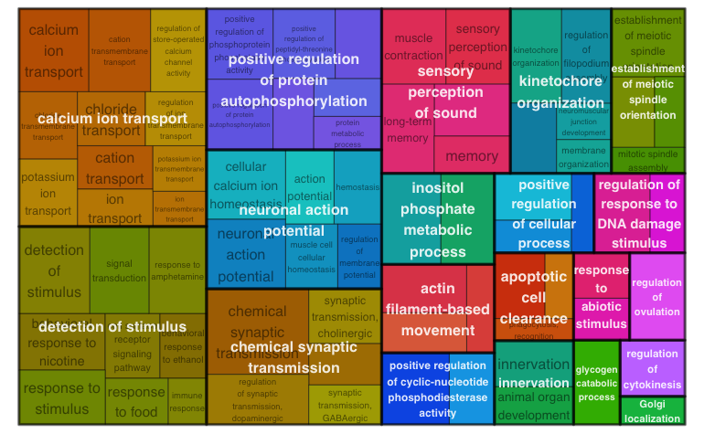

### NOTES: 

+ Within the code, there are square brackets in square brackets those paths that must be modified by the user for its use.

+ The lines of code marked with a @ between the lines must be run repeatedly for each sample. 

# DOWNLOAD DATA

### Reference genome data 
To initiate the analysis, we required to process the RNA-seq data from Tournière, et al. (2020).
To achieve this, reference genomic data must be downloaded.

To download the complete fasta file of the sequence genome. Run in terminal
```{bash, eval=F}
wget ftp://ftp.ensemblgenomes.org/pub/metazoa/release-51/fasta/nematostella_vectensis/dna/Nematostella_vectensis.ASM20922v1.dna.toplevel.fa.gz
```

To download all annotation files, please go to https://doi.org/https://doi.org/10.6084/m9.figshare.807696.v2 
Or run in terminal

```{bash, eval=F}
wget https://figshare.com/ndownloader/articles/807696/versions/2
unzip 2
```

In order to run this script, you can clone the repository from Github. The annotation data downloaded in the previous step should be located in the folder ref_genomes


### RNA-seq data 

To download all files interactively, go to https://www.ebi.ac.uk/arrayexpress/experiments/E-MTAB-8658/ Or run in terminal
```{bash, eval=F}
cd data
# POU mutants data
wget ftp://ftp.sra.ebi.ac.uk/vol1/fastq/ERR380/003/ERR3809533/ERR3809533.fastq.gz
wget ftp://ftp.sra.ebi.ac.uk/vol1/fastq/ERR380/002/ERR3809532/ERR3809532.fastq.gz
wget ftp://ftp.sra.ebi.ac.uk/vol1/fastq/ERR380/004/ERR3809534/ERR3809534.fastq.gz
wget ftp://ftp.sra.ebi.ac.uk/vol1/fastq/ERR380/005/ERR3809535/ERR3809535.fastq.gz

# POU wild type data
wget ftp://ftp.sra.ebi.ac.uk/vol1/fastq/ERR380/006/ERR3809536/ERR3809536.fastq.gz
wget ftp://ftp.sra.ebi.ac.uk/vol1/fastq/ERR380/007/ERR3809537/ERR3809537.fastq.gz
wget ftp://ftp.sra.ebi.ac.uk/vol1/fastq/ERR380/008/ERR3809538/ERR3809538.fastq.gz
wget ftp://ftp.sra.ebi.ac.uk/vol1/fastq/ERR380/009/ERR3809539/ERR3809539.fastq.gz

```


To uncompress the file, run 
```{bash,eval=F}
gzip *.fastq.gz
#Then we move the files
mv *.fastq /before_trim
```

These data downloaded should be located in data/before_trim folder

### ChIP-seq data

Go to [link] Or run in terminal
```{bash,eval=F}
 wget [link]
```


# DATA QUALITY

### RNA-seq data

For RNA-seq data, we use fastqc, in terminal run
```{bash, eval=F}
fastqc -O quality_files/before_trim data/*fastq

```

The html files, will be located in quality_files/before_trim

Since k-mer content, sequence duplication levels and overrepresented sequences may fail due to adaptor content or poor sequence quality, we used the Trimmomatic tool to process the datasets.
For this, we download illumina adapters from https://gist.github.com/photocyte/3edd9401d0b13476e60f8b104c2575f8 and then run in terminal

```{bash,eval=F}

cd data/
java -jar [#PATH_TO_TRIMMOMATIC_JAVA_FILE]/trimmomatic-0.32.jar SE -threads 4 before_trim/ERR3809539.fastq Nematostella_vectensis_CH2_12d_POU-+_wild_rep4.fastq ILLUMINACLIP:Sequencing_adaptors.fasta:2:30:10 SLIDINGWINDOW:4:15 MINLEN:60 HEADCROP:10
java -jar [#PATH_TO_TRIMMOMATIC_JAVA_FILE]/trimmomatic-0.32.jar SE -threads 4 before_trim/ERR3809538.fastq Nematostella_vectensis_CH2_12d_POU-+_wild_rep3.fastq ILLUMINACLIP:Sequencing_adaptors.fasta:2:30:10 SLIDINGWINDOW:4:15 MINLEN:60 HEADCROP:10
java -jar [#PATH_TO_TRIMMOMATIC_JAVA_FILE]/trimmomatic-0.32.jar SE -threads 4 before_trim/ERR3809537.fastq Nematostella_vectensis_CH2_12d_POU-+_wild_rep2.fastq ILLUMINACLIP:Sequencing_adaptors.fasta:2:30:10 SLIDINGWINDOW:4:15 MINLEN:60 HEADCROP:10
java -jar [#PATH_TO_TRIMMOMATIC_JAVA_FILE]/trimmomatic-0.32.jar SE -threads 4 before_trim/ERR3809536.fastq Nematostella_vectensis_CH2_12d_POU-+_wild_rep1.fastq ILLUMINACLIP:Sequencing_adaptors.fasta:2:30:10 SLIDINGWINDOW:4:15 MINLEN:60 HEADCROP:10

java -jar [#PATH_TO_TRIMMOMATIC_JAVA_FILE]/trimmomatic-0.32.jar SE -threads 4 before_trim/ERR3809533.fastq Nematostella_vectensis_CH2_12d_POU--_rep1 ILLUMINACLIP:Sequencing_adaptors.fasta:2:30:10 SLIDINGWINDOW:4:15 MINLEN:60 HEADCROP:10
java -jar [#PATH_TO_TRIMMOMATIC_JAVA_FILE]/trimmomatic-0.32.jar SE -threads 4 before_trim/ERR3809532.fastq Nematostella_vectensis_CH2_12d_POU--_rep2 ILLUMINACLIP:Sequencing_adaptors.fasta:2:30:10 SLIDINGWINDOW:4:15 MINLEN:60 HEADCROP:10
java -jar [#PATH_TO_TRIMMOMATIC_JAVA_FILE]/trimmomatic-0.32.jar SE -threads 4 before_trim/ERR3809534.fastq Nematostella_vectensis_CH2_12d_POU--_rep3 ILLUMINACLIP:Sequencing_adaptors.fasta:2:30:10 SLIDINGWINDOW:4:15 MINLEN:60 HEADCROP:10
java -jar [#PATH_TO_TRIMMOMATIC_JAVA_FILE]/trimmomatic-0.32.jar SE -threads 4 before_trim/ERR3809535.fastq Nematostella_vectensis_CH2_12d_POU--_rep4 ILLUMINACLIP:Sequencing_adaptors.fasta:2:30:10 SLIDINGWINDOW:4:15 MINLEN:60 HEADCROP:10
```

We included the code for all replicates in order to ensure that the file names are correct.We can check data quelity again, using this code in terminal

```{bash,eval=F}
fastqc -O quality_files/after_trim data/*fastq

```

The html files, will be located in quality_files/after_trim


### ChIP-seq data
We use ChipQC in R

You can install it, using 
```{r,eval=FALSE}
BiocManager::install("ChIPQC")
```

And then, we can run 
```{r}
library(ChIPQC)
sample1 = ChIPQCsample('../data/[]')
sample2 = ChIPQCsample('../data/[]')
sample3 = ChIPQCsample('../data/[]')

# Report from sample 1
ChIPQCreport(sample1)
# Report from sample 2
ChIPQCreport(sample2)
# Report from sample 3
ChIPQCreport(sample3)
```


# GUIDED SEQUENCE ALIGNMENT 

We proceeded to the alignment of the reads with the reference genome using STAR. 
First, we need the headers to be equal, to achieve this, run in data folder
```{bash, eval=F}
sed 's/NEMVE//g' [fasta_file_with_sequences] > Nvectensis.fa
```

Then we generate the index using the following lines in terminal 
```{bash, eval=F}
STAR --runThreadN 6 --runMode genomeGenerate --genomeDir STAR_genome_index --genomeFastaFiles ref_genomes/[Nvectensis.fa] --sjdbGTFfile ref_genomes/[nveGenes.vienna130208.nemVec1.gtf] --sjdbOverhang 99
```

Once the index was completed, we used each trimmed read and aligned to the reference genome using STAR tools. The following code is an example of the code for replicate 1 of the POU+/- biological sample. 

```{bash,eval=F}
#@ run for each replicate
STAR --runThreadN 6 --genomeDir  ref_genomes/ --readFilesIn data/Nematostella_vectensis_CH2_12d_POU-+_wild_rep1.fastq --outFileNamePrefix alignment/Nematostella_vectensis_CH2_12d_POU-+_wild_rep1
#@ run for each replicate
```

# RNA-seq

First we must sort and count the alignments made by STAR. For this, we use HTseq and samtools. In terminal, we run 

```{bash, eval=FALSE}
cd alignment
#@ run for each replicate
# To compress file to bam
samtools view -S -b alignment/Nematostella_vectensis_CH2_12d_POU-+_wild_rep1.out.sam > Nvect_POU-+_rep1_Aligned.bam
# Sort 
samtools sort Nvect_POU-+_rep1_Aligned.bam -o Nvect_POU-+_rep1_sorted.bam
# Counts 
htseq-count -f bam -s yes -r pos Nvect_POU-+_rep1_sorted.bam ../ref_genomes/[nveGenes.vienna130208.nemVec1.gtf] > POU-+_rep1.counts
#@ run for each replicate
```

Finally, merge the readings into a single count table. 
```{bash,eval=FALSE}
cd alignment
paste POU--_rep*.counts POU-+_rep*.counts > counts_table_DGE.txt
```

I then used R to load the data. First, I read the DGE results
```{r, message=FALSE, warning=FALSE}
library(DESeq2)
library(apeglm)
#Read data
data.dge <- read.delim(file = '../alignment/counts_table_DGE.txt',sep = '\t', header = F, row.names = 1)
#Assign names
condition <- factor(c("POU_ko","POU_ko","POU_ko","POU_ko","POU_wt","POU_wt","POU_wt","POU_wt"), levels = c('POU_wt','POU_ko'))
colData <- data.frame(row.names=colnames(data.dge), condition)

dds <- DESeqDataSetFromMatrix(countData = data.dge,
                              colData = colData,
                              design = ~ condition )

#Erase data with no counts
dds <- dds[ rowSums(counts(dds)) > 1, ]
dds <- DESeq(dds)
res <- results(dds)

#You can preprocces all again, and you should get this figure 
resLFC <- lfcShrink(dds, coef=2, type="apeglm")
plotMA(resLFC, ylim=c(-4,4))
```

If we want to confirm the numbers from downregulated and upregulated genes with different p values 
```{r}
#Para 0.05
nrow(data.frame(resLFC@rownames[resLFC@listData[["pvalue"]] <0.05]))
#Para 0.01
nrow(data.frame(resLFC@rownames[resLFC@listData[["pvalue"]] <0.01]))
```

Then, to list the downregulated and upregulated genes 
```{r}
#Keep only p-value<0.01
differential_genes <- data.frame(resLFC@rownames[resLFC@listData[["pvalue"]] <0.01])
#Add column name
colnames(differential_genes) <- c('gene')
#Add Fold change
differential_genes$fold_change <- resLFC@listData[["log2FoldChange"]][resLFC@listData[["pvalue"]] <0.01]
#Add base mean
differential_genes$mean_counts <- resLFC@listData[["baseMean"]][resLFC@listData[["pvalue"]] <0.01]
#Add p value
differential_genes$pvalue <- resLFC@listData[["pvalue"]][resLFC@listData[["pvalue"]] <0.01]
# Eliminate empty rows
differential_genes <- differential_genes[complete.cases(differential_genes),]
```

From the annotation data we previously downloaded, we have nveGenes.vienna130208.GO_annotation_141017.txt which listed the genes with its GO terms. It is usefull to read this in R. Also, it is useful to have the p-values of the DGE in this dataframe because they can be used as scores for Gene ontology enrichment. 
```{r,eval=FALSE}
#Read file
GO_terms <- read.delim(file = '../data/nveGenes.vienna130208.GO_annotation_141017.txt',sep = '\t', header = F)
# Extract those that are differentially expressed
GO_terms_differential_expressed <- GO_terms[GO_terms$V1%in%differential_genes$gene, ]
#Quiero tener los valores de p, guardados en differential_genes$pvalue en el df de GO
for(j in 1:nrow(GO_terms_differential_expressed)) {
  for(k in 1:nrow(differential_genes)) {
     if (GO_terms_differential_expressed$V1[j] == differential_genes$gene[k]) {
         GO_terms_differential_expressed$pvalue[j] <- differential_genes$pvalue[k]
     }
    k <- k+1
  }
  j<- j+1
  }
```

Now that we have these data loaded, more data were loaded into the dataframe for the differentially expressed genes. For example, the JGI_ID, for this the equivalence_table.txt file in the data folder is used. This file was generated using bedtools intersect on the JGI genomic annotation and the one used in the present analysis. 

```{r}
#reading table
equival <- read.delim(file = '../data/equivalence_table.tsv',sep = '\t', header = F)
###Loop for extracting data 
differential_genes$JGI_ID <- 'No data'
j <-1
k<-1

for(j in 1:nrow(differential_genes)) {
  for(k in 1:nrow(equival)) {
     if (differential_genes$gene[j] == equival$V1[k]) {
         differential_genes$JGI_ID[j] <- equival$V3[k]
     }
    k <- k+1
  }
  j<- j+1
}


upregulated_genes <- differential_genes[differential_genes$fold_change>0,]
downregulated_genes <- differential_genes[differential_genes$fold_change<0,]
```


Now that I have this data, I can perform a GO enrichment analysis. 

```{r,eval=FALSE}
library(rrvgo)
library(org.Ce.eg.db) #C. elegans data as reference 
library(clusterProfiler)
#We need some dfs to do the job 

#Getting terms to gene dataframe
GOterms_to_genes <- GOterms_to_genes[,c(3,1)]
colnames(GOterms_to_genes) <- c('term','gene')
#Getting term to name df
GOterms_to_names <- GOterms_to_names[,c(3,4)]
colnames(GOterms_to_names) <- c('term','name')

#GO enrichment for downregulated genes
ggo <- enricher(
  downregulated_genes$gene,
  pvalueCutoff = 0.05,
  pAdjustMethod = "BH",
  TERM2GENE=GOterms_to_genes,
  TERM2NAME = GOterms_to_names
)

#GO enrichment result
ggo_result <- ggo@result
#Filtering GO enrichment result
ggo_result <- ggo_result[ggo_result$p.adjust<0.05,]

#Generating matrix to plot
simMatrix <- calculateSimMatrix(ggo_result$ID,
                                orgdb="org.Ce.eg.db",
                                ont="BP",
                                method="Rel")

GO_terms_names <- ggo_result[ggo_result$ID%in%row.names(simMatrix),]
scores <- setNames(-log10(GO_terms_names$p.adjust), GO_terms_names$ID)
#Reducing dimensions to plot
reducedTerms <- reduceSimMatrix(simMatrix, scores,
                                orgdb="org.Ce.eg.db", threshold = 0.8)
treemapPlot(reducedTerms)
```

Using the above code, we should produce a figure like the following one 



# SYSTEM INFORMATION

The system information used to run this analysis.

```{r}
options(width = 120)
pkgs <- loadedNamespaces()
pkgs <- installed.packages()[, "Package"]
sessioninfo::session_info(pkgs)
```


