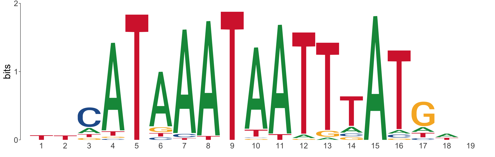

### NOTES: 

+ Within the code, there are square brackets in square brackets those paths that must be modified by the user for its use.

+ The lines of code marked with a @ between the lines must be run repeatedly for each sample. 

# DOWNLOAD DATA

### Reference genome data 
To initiate the analysis, we required to process the RNA-seq data from Tournière, et al. (2020).
To achieve this, reference genomic data must be downloaded.

To download the complete fasta file of the sequence genome. Run in terminal
```{bash, eval=F}
wget ftp://ftp.ensemblgenomes.org/pub/metazoa/release-51/fasta/nematostella_vectensis/dna/Nematostella_vectensis.ASM20922v1.dna.toplevel.fa.gz
```

To download all annotation files, please go to https://doi.org/https://doi.org/10.6084/m9.figshare.807696.v2 
Or run in terminal

```{bash, eval=F}
wget https://figshare.com/ndownloader/articles/807696/versions/2
unzip 2
```

In order to run this script, you can clone the repository from Github. The annotation data downloaded in the previous step should be located in the folder ref_genomes


### RNA-seq data 

To download all files interactively, go to https://www.ebi.ac.uk/arrayexpress/experiments/E-MTAB-8658/ Or run in terminal
```{bash, eval=F}
cd data
# POU mutants data
wget ftp://ftp.sra.ebi.ac.uk/vol1/fastq/ERR380/003/ERR3809533/ERR3809533.fastq.gz
wget ftp://ftp.sra.ebi.ac.uk/vol1/fastq/ERR380/002/ERR3809532/ERR3809532.fastq.gz
wget ftp://ftp.sra.ebi.ac.uk/vol1/fastq/ERR380/004/ERR3809534/ERR3809534.fastq.gz
wget ftp://ftp.sra.ebi.ac.uk/vol1/fastq/ERR380/005/ERR3809535/ERR3809535.fastq.gz

# POU wild type data
wget ftp://ftp.sra.ebi.ac.uk/vol1/fastq/ERR380/006/ERR3809536/ERR3809536.fastq.gz
wget ftp://ftp.sra.ebi.ac.uk/vol1/fastq/ERR380/007/ERR3809537/ERR3809537.fastq.gz
wget ftp://ftp.sra.ebi.ac.uk/vol1/fastq/ERR380/008/ERR3809538/ERR3809538.fastq.gz
wget ftp://ftp.sra.ebi.ac.uk/vol1/fastq/ERR380/009/ERR3809539/ERR3809539.fastq.gz

```


To uncompress the file, run 
```{bash,eval=F}
gzip *.fastq.gz
#Then we move the files
mv *.fastq /before_trim
```

These data downloaded should be located in data/before_trim folder

### ChIP-seq data

Go to [link] Or run in terminal
```{bash,eval=F}
 wget [link]
```


# DATA QUALITY

### RNA-seq data

For RNA-seq data, we use fastqc, in terminal run
```{bash, eval=F}
fastqc -O quality_files/before_trim data/*fastq

```

The html files, will be located in quality_files/before_trim

Since k-mer content, sequence duplication levels and overrepresented sequences may fail due to adaptor content or poor sequence quality, we used the Trimmomatic tool to process the datasets.
For this, we download illumina adapters from https://gist.github.com/photocyte/3edd9401d0b13476e60f8b104c2575f8 and then run in terminal

```{bash,eval=F}

cd data/
java -jar [#PATH_TO_TRIMMOMATIC_JAVA_FILE]/trimmomatic-0.32.jar SE -threads 4 before_trim/ERR3809539.fastq Nematostella_vectensis_CH2_12d_POU-+_wild_rep4.fastq ILLUMINACLIP:Sequencing_adaptors.fasta:2:30:10 SLIDINGWINDOW:4:15 MINLEN:60 HEADCROP:10
java -jar [#PATH_TO_TRIMMOMATIC_JAVA_FILE]/trimmomatic-0.32.jar SE -threads 4 before_trim/ERR3809538.fastq Nematostella_vectensis_CH2_12d_POU-+_wild_rep3.fastq ILLUMINACLIP:Sequencing_adaptors.fasta:2:30:10 SLIDINGWINDOW:4:15 MINLEN:60 HEADCROP:10
java -jar [#PATH_TO_TRIMMOMATIC_JAVA_FILE]/trimmomatic-0.32.jar SE -threads 4 before_trim/ERR3809537.fastq Nematostella_vectensis_CH2_12d_POU-+_wild_rep2.fastq ILLUMINACLIP:Sequencing_adaptors.fasta:2:30:10 SLIDINGWINDOW:4:15 MINLEN:60 HEADCROP:10
java -jar [#PATH_TO_TRIMMOMATIC_JAVA_FILE]/trimmomatic-0.32.jar SE -threads 4 before_trim/ERR3809536.fastq Nematostella_vectensis_CH2_12d_POU-+_wild_rep1.fastq ILLUMINACLIP:Sequencing_adaptors.fasta:2:30:10 SLIDINGWINDOW:4:15 MINLEN:60 HEADCROP:10

java -jar [#PATH_TO_TRIMMOMATIC_JAVA_FILE]/trimmomatic-0.32.jar SE -threads 4 before_trim/ERR3809533.fastq Nematostella_vectensis_CH2_12d_POU--_rep1 ILLUMINACLIP:Sequencing_adaptors.fasta:2:30:10 SLIDINGWINDOW:4:15 MINLEN:60 HEADCROP:10
java -jar [#PATH_TO_TRIMMOMATIC_JAVA_FILE]/trimmomatic-0.32.jar SE -threads 4 before_trim/ERR3809532.fastq Nematostella_vectensis_CH2_12d_POU--_rep2 ILLUMINACLIP:Sequencing_adaptors.fasta:2:30:10 SLIDINGWINDOW:4:15 MINLEN:60 HEADCROP:10
java -jar [#PATH_TO_TRIMMOMATIC_JAVA_FILE]/trimmomatic-0.32.jar SE -threads 4 before_trim/ERR3809534.fastq Nematostella_vectensis_CH2_12d_POU--_rep3 ILLUMINACLIP:Sequencing_adaptors.fasta:2:30:10 SLIDINGWINDOW:4:15 MINLEN:60 HEADCROP:10
java -jar [#PATH_TO_TRIMMOMATIC_JAVA_FILE]/trimmomatic-0.32.jar SE -threads 4 before_trim/ERR3809535.fastq Nematostella_vectensis_CH2_12d_POU--_rep4 ILLUMINACLIP:Sequencing_adaptors.fasta:2:30:10 SLIDINGWINDOW:4:15 MINLEN:60 HEADCROP:10
```

We included the code for all replicates in order to ensure that the file names are correct.We can check data quelity again, using this code in terminal

```{bash,eval=F}
fastqc -O quality_files/after_trim data/*fastq

```

The html files, will be located in quality_files/after_trim


### ChIP-seq data
We use phantompeakqualtools, to install it, go to https://github.com/kundajelab/phantompeakqualtools
We run in terminal
```{bash,eval=F}
#$
Rscript [/path_to_spp_script]run_spp.R -c=[ChIPseq_rep1] -savp -out=[ChIPseq_rep1.outphantom]
#$
```

Alternatively we can use ChipQC in R

You can install it, using 
```{r,eval=FALSE}
BiocManager::install("ChIPQC")
```

And then, we can run 
```{r, eval=FALSE}
library(ChIPQC)
sample1 = ChIPQCsample('../data/[ChIPseq_rep1]')
sample2 = ChIPQCsample('../data/[ChIPseq_rep2]')
sample3 = ChIPQCsample('../data/[ChIPseq_rep3]')

# Report from sample 1
ChIPQCreport(sample1)
# Report from sample 2
ChIPQCreport(sample2)
# Report from sample 3
ChIPQCreport(sample3)
```


# GUIDED SEQUENCE ALIGNMENT 

We proceeded to the alignment of the reads with the reference genome using STAR. 
First, we need the headers to be equal, to achieve this, run in data folder
```{bash, eval=F}
sed 's/NEMVE//g' [fasta_file_with_sequences] > Nvectensis.fa
```

Then we generate the index using the following lines in terminal 
```{bash, eval=F}
STAR --runThreadN 6 --runMode genomeGenerate --genomeDir STAR_genome_index --genomeFastaFiles ref_genomes/[Nvectensis.fa] --sjdbGTFfile ref_genomes/[nveGenes.vienna130208.nemVec1.gtf] --sjdbOverhang 99
```

Once the index was completed, we used each trimmed read and aligned to the reference genome using STAR tools. The following code is an example of the code for replicate 1 of the POU+/- biological sample. 

```{bash,eval=F}
#@ run for each replicate
STAR --runThreadN 6 --genomeDir  ref_genomes/ --readFilesIn data/Nematostella_vectensis_CH2_12d_POU-+_wild_rep1.fastq --outFileNamePrefix alignment/Nematostella_vectensis_CH2_12d_POU-+_wild_rep1
#@ run for each replicate
```

# RNA-seq

First we must sort and count the alignments made by STAR. For this, we use HTseq and samtools. In terminal, we run 

```{bash, eval=FALSE}
cd alignment
#@ run for each replicate
# To compress file to bam
samtools view -S -b alignment/Nematostella_vectensis_CH2_12d_POU-+_wild_rep1.out.sam > Nvect_POU-+_rep1_Aligned.bam
# Sort 
samtools sort Nvect_POU-+_rep1_Aligned.bam -o Nvect_POU-+_rep1_sorted.bam
# Counts 
htseq-count -f bam -s yes -r pos Nvect_POU-+_rep1_sorted.bam ../ref_genomes/[nveGenes.vienna130208.nemVec1.gtf] > POU-+_rep1.counts
#@ run for each replicate
```

Finally, merge the readings into a single count table. 
```{bash,eval=FALSE}
cd alignment
paste POU--_rep*.counts POU-+_rep*.counts > counts_table_DGE.txt
```

I then used R to load the data. First, I read the DGE results
```{r, message=FALSE, warning=FALSE}
library(DESeq2)
library(apeglm)
#Read data
data.dge <- read.delim(file = '../alignment/counts_table_DGE.txt',sep = '\t', header = F, row.names = 1)
#Assign names
condition <- factor(c("POU_ko","POU_ko","POU_ko","POU_ko","POU_wt","POU_wt","POU_wt","POU_wt"), levels = c('POU_wt','POU_ko'))
colData <- data.frame(row.names=colnames(data.dge), condition)

dds <- DESeqDataSetFromMatrix(countData = data.dge,
                              colData = colData,
                              design = ~ condition )

#Erase data with no counts
dds <- dds[ rowSums(counts(dds)) > 1, ]
dds <- DESeq(dds)
res <- results(dds)

#You can preprocces all again, and you should get this figure 
resLFC <- lfcShrink(dds, coef=2, type="apeglm")
plotMA(resLFC, ylim=c(-4,4))
```

If we want to confirm the numbers from downregulated and upregulated genes with different p values 
```{r}
#Para 0.05
nrow(data.frame(resLFC@rownames[resLFC@listData[["pvalue"]] <0.05]))
#Para 0.01
nrow(data.frame(resLFC@rownames[resLFC@listData[["pvalue"]] <0.01]))
```

Then, to list the downregulated and upregulated genes 
```{r}
#Keep only p-value<0.01
differential_genes <- data.frame(resLFC@rownames[resLFC@listData[["pvalue"]] <0.01])
#Add column name
colnames(differential_genes) <- c('gene')
#Add Fold change
differential_genes$fold_change <- resLFC@listData[["log2FoldChange"]][resLFC@listData[["pvalue"]] <0.01]
#Add base mean
differential_genes$mean_counts <- resLFC@listData[["baseMean"]][resLFC@listData[["pvalue"]] <0.01]
#Add p value
differential_genes$pvalue <- resLFC@listData[["pvalue"]][resLFC@listData[["pvalue"]] <0.01]
# Eliminate empty rows
differential_genes <- differential_genes[complete.cases(differential_genes),]
```

From the annotation data we previously downloaded, we have nveGenes.vienna130208.GO_annotation_141017.txt which listed the genes with its GO terms. It is usefull to read this in R. Also, it is useful to have the p-values of the DGE in this dataframe because they can be used as scores for Gene ontology enrichment. 
```{r,eval=FALSE}
#Read file
GO_terms <- read.delim(file = '../data/nveGenes.vienna130208.GO_annotation_141017.txt',sep = '\t', header = F)
# Extract those that are differentially expressed
GO_terms_differential_expressed <- GO_terms[GO_terms$V1%in%differential_genes$gene, ]
#Quiero tener los valores de p, guardados en differential_genes$pvalue en el df de GO
for(j in 1:nrow(GO_terms_differential_expressed)) {
  for(k in 1:nrow(differential_genes)) {
     if (GO_terms_differential_expressed$V1[j] == differential_genes$gene[k]) {
         GO_terms_differential_expressed$pvalue[j] <- differential_genes$pvalue[k]
     }
    k <- k+1
  }
  j<- j+1
  }
```

Now that we have these data loaded, more data were loaded into the dataframe for the differentially expressed genes. For example, the JGI_ID, for this the equivalence_table.txt file in the data folder is used. This file was generated using bedtools intersect on the JGI genomic annotation and the one used in the present analysis. 

```{r}
#reading table
equival <- read.delim(file = '../data/equivalence_table.tsv',sep = '\t', header = F)
###Loop for extracting data 
differential_genes$JGI_ID <- 'No data'
j <-1
k<-1

for(j in 1:nrow(differential_genes)) {
  for(k in 1:nrow(equival)) {
     if (differential_genes$gene[j] == equival$V1[k]) {
         differential_genes$JGI_ID[j] <- equival$V3[k]
     }
    k <- k+1
  }
  j<- j+1
}


upregulated_genes <- differential_genes[differential_genes$fold_change>0,]
downregulated_genes <- differential_genes[differential_genes$fold_change<0,]
```


Now that I have this data, I can perform a GO enrichment analysis. 

```{r,eval=FALSE}
library(rrvgo)
library(org.Ce.eg.db) #C. elegans data as reference 
library(clusterProfiler)
#We need some dfs to do the job 

#Getting terms to gene dataframe
GOterms_to_genes <- GOterms_to_genes[,c(3,1)]
colnames(GOterms_to_genes) <- c('term','gene')
#Getting term to name df
GOterms_to_names <- GOterms_to_names[,c(3,4)]
colnames(GOterms_to_names) <- c('term','name')

#GO enrichment for downregulated genes
ggo <- enricher(
  downregulated_genes$gene,
  pvalueCutoff = 0.05,
  pAdjustMethod = "BH",
  TERM2GENE=GOterms_to_genes,
  TERM2NAME = GOterms_to_names
)

#GO enrichment result
ggo_result <- ggo@result
#Filtering GO enrichment result
ggo_result <- ggo_result[ggo_result$p.adjust<0.05,]

#Generating matrix to plot
simMatrix <- calculateSimMatrix(ggo_result$ID,
                                orgdb="org.Ce.eg.db",
                                ont="BP",
                                method="Rel")

GO_terms_names <- ggo_result[ggo_result$ID%in%row.names(simMatrix),]
scores <- setNames(-log10(GO_terms_names$p.adjust), GO_terms_names$ID)
#Reducing dimensions to plot
reducedTerms <- reduceSimMatrix(simMatrix, scores,
                                orgdb="org.Ce.eg.db", threshold = 0.8)
treemapPlot(reducedTerms)
```

Using the above code, we should produce a figure like the following one 


# ChIP-seq analysis 

ChIP-seq technique was used to obtain target gene sequences of the transcription factor POU-IV. We used Macs2 software to perform the peak calling of the reads. 
```{bash,eval=FALSE}
macs2 callpeak -t data/[ChIPseq_rep1] -c data/[ChIPseq_rep1_input] -f BAMPE -g 361523379 -n cp -B
```

Then we used "Multiple Sample Peak Calling (MSPC)" to improve sensitivity and specificity of peak calling, and identify consensus regions of multiple peaks (Jalili, **et al**., 2015). Setting the p-value threeshold to 1e-8 we obtained 5,015 consensus peaks using the following code 
```{bash,eval=FALSE}
# Code used to obtain consensus peaks. 
[path_to_mspc]/mspc -i data/*.narrowPeak -r tec -w 1e-4 -s 1e-8 -o ./MSPC_outdir
```

Subsequently, bedtools get fasta was used to obtain the fasta sequences to be analyzed in Rsat. For this we use the following code. 
```{bash,eval=FALSE}
bedtools getfasta -fi ../ref_genomes/Nvectensis.fa -bed MSPC_outdir/ConsensusPeaks.bed -fo consensus_peaks_sequence
```

This file can be uploaded in http://rsat.sb-roscoff.fr/peak-motifs_form.cgi with the option local-word-analysis in motif discovery parameters. The results were downloaded and uploaded to Tomtom against the Jaspar database.

Results can be found in the following table 

|Motif|Number of peaks with at least one predicted site |Mean of predicted sites per peak| Jaspar non-redundant database hits wit cor value|E-value|
|:--------------------|:----|:----|:--------|:----|
||724 (5.58%)| 1.23| -POU4F3 (0.845	) <br /> -POU4F2 (0.779)<br /> -POU4F1 (0.870) |5.2e-75|
||429 (3.31%)| 2.16| -POU4F3 (0.818) <br /> -POU4F1 (0.829)<br /> -POU4F2 (0.734) |1.2e-52|
||1892 (14.54%)| 1.60| -POU4F3 (0.840) <br /> -POU4F1 (0.736)<br /> -POU4F2 (0.842) |4.8e-36|


# Differential gene expression in POU-IV target genes. 
To complement the present analysis, we wanted to know which genes differentially expressed by the POU-IV mutant were found within the reads of the ChIP-seq experiment. That is, whether there were POU-IV target genes (ChIP-seq) that were differentially expressed by the absence of POU-IV in the mutants (RNA-seq). For this purpose, 450 bp were used as promoter regions, 350 bp upstream of the TSS and 100 bp downstream of the TSS. 
```{r, eval=FALSE}
library('GenomicFeatures')
library("GenomicRanges")
library("AnnotationHub")
library("rtracklayer")

#Reading annotation files
anota_data <-  makeTxDbFromGFF(file = '../data/[annotation_file.gtf]', format = "gff3")

#getting promoters
promoters_genome <- data.frame(promoters(genes(anota_data), upstream = 350, downstream = 100))
promoters_genome$start[promoters_genome$start<0] <- 0


#To get the genes
genes_anotation <- data.frame(genes(anota_data))
#Write file to bedtools
write.table(x = genes_anotation,file = '../data/genes.bed',quote = F,sep = '\t',row.names = F,col.names = F)
write.table(x = promoters_total,file = '../data/promoter.bed',quote = F,sep = '\t',row.names = F,col.names = F)

```

Then, we used bedtools to find intersections in these data
```{bash,eval=F}
bedtools intersect -wb -a  MSPC_outdir_1/ConsensusPeaks.bed -b promoter.bed  > peaks_on_promoters.tsv
bedtools intersect -wb -a  MSPC_outdir_1/ConsensusPeaks.bed -b genes.bed  > peaks_on_genes.tsv
```

We can read the files in R with 
```{r}
#Change the name of the file to peaks_on_promoters.tsv and peaks_on_genes.tsv
peaks_on_promoters <- read.table(file = '../data/peaks_on_prom_example.tsv', sep = '\t')
peaks_on_genes <- read.table(file = '../data/peaks_on_gene_example.tsv', sep = '\t')
```

Then we need to get the genes that have peaks either in promoter region or in the gene body 
```{r}
#Promoter regions of genes with peaks 
#There should not be repeated data
peaks_on_promoters <- peaks_on_promoters[,c(6,7,8,9,10,11)]
peaks_on_promoters <- peaks_on_promoters[!duplicated(peaks_on_promoters),]

print('We have 1271 genes with peaks on the promoter region')

#Genes with peaks
#Should not be duplicated data 
genes_with_peaks <- peaks_on_genes[,c(6,7,8,9,10,11)]
genes_with_peaks <- genes_with_peaks[!duplicated(genes_with_peaks),]
print('We have 3867 genes with peaks on the promoter region')
```

Finally, we want to know which differentially expressed genes are marked with peaks and in which regions.

```{r}
library(dplyr)
###########Peaks on differentially expressed genes ########
differential_genes_with_peaks_on_genes <-differential_genes[differential_genes$gene%in%genes_with_peaks$V11,]

###########Peaks on promoter ########
differential_genes_with_peaks_on_promoter <-differential_genes[differential_genes$gene%in%peaks_on_promoters$V11,]


#List of all genes
differential_genes_with_peaks_all <- unique.data.frame(data.frame(rbind(differential_genes_with_peaks_on_promoter,differential_genes_with_peaks_on_genes)))

differential_genes_with_peaks_upregulated <- differential_genes_with_peaks_all[differential_genes_with_peaks_all$fold_change>0,]

differential_genes_with_peaks_downregulated <- differential_genes_with_peaks_all[differential_genes_with_peaks_all$fold_change<0,]

#Differences in the data 
genes_with_peaks_in_gene_body <- differential_genes_with_peaks_on_genes[!differential_genes_with_peaks_on_genes$gene%in%differential_genes_with_peaks_on_promoter$gene,]

genes_with_peaks_in_promoter_region <- differential_genes_with_peaks_on_promoter[!differential_genes_with_peaks_on_promoter$gene%in%differential_genes_with_peaks_on_genes$gene,]

genes_with_peaks_on_gene_body_and_promoter_region <- differential_genes_with_peaks_on_genes[differential_genes_with_peaks_on_genes$gene%in%differential_genes_with_peaks_on_promoter$gene,]
```

To graphically observe the results, we use ggven
```{r, eval=FALSE}
library(ggvenn)

x <- list(Gene_body = differential_genes_with_peaks_on_genes$gene,Promoters = differential_genes_with_peaks_on_promoter$gene)
ggvenn(x,
         fill_color = c("#0073C2FF", "#CD534CFF"),
  stroke_size = 0.5, set_name_size = 4
  )+
ggtitle('Venn diagram of ChIP-seq peaks in regions of \n differentially expressed genes.')
```
We should get a figure like this 


Finally, we used the same approach as in the RNA-seq data to find the GO terms enriched in the data and reduced the dimensions to plot them using the following code

```{r, eval=F}
#Graphic
library(rrvgo)
library(org.Ce.eg.db)
ddgt <- differential_genes_with_peaks_on_promoter[differential_genes_with_peaks_on_promoter$fold_change<0,]
gene_enricher <- ddgt$gene
ggo <- enricher(
  gene_enricher,
  pvalueCutoff = 0.05,
  pAdjustMethod = "BH",
  minGSSize = 10,
  maxGSSize = 500,
  qvalueCutoff = 0.2,
  TERM2GENE=GOterms_to_genes,
  TERM2NAME = GOterms_to_names
)

ggo_result <- ggo@result
ggo_result <- ggo_result[ggo_result$p.adjust<0.05,]
simMatrix <- calculateSimMatrix(ggo_result$ID,
                                orgdb="org.Ce.eg.db",
                                ont="BP",
                                method="Rel")

GO_terms_names <- ggo_result[ggo_result$ID%in%row.names(simMatrix),]
scores <- setNames(-log10(GO_terms_names$p.adjust), GO_terms_names$ID)
reducedTerms <- reduceSimMatrix(simMatrix, scores,
                                orgdb="org.Ce.eg.db", threshold = 0.7)
treemapPlot(reducedTerms)
```

We should get the following plot 


# SYSTEM INFORMATION

The system information used to run this analysis.

```{r}
options(width = 120)
pkgs <- loadedNamespaces()
pkgs <- installed.packages()[, "Package"]
sessioninfo::session_info(pkgs)
```


